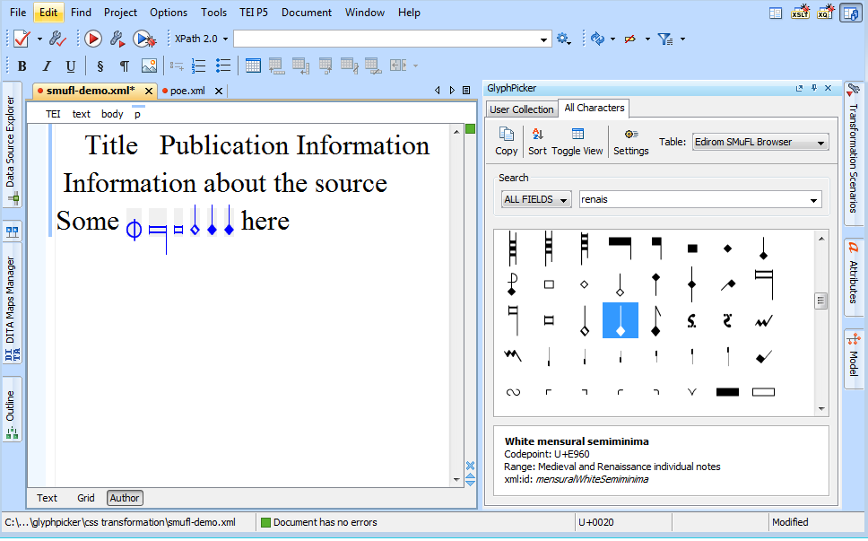

# </img>GlyphPicker

The GlyphPicker plugin is an add-on to the XML editor [oXygen](http://www.oxygenxml.com/) and provides
support for inserting non-standard characters into TEI documents.

The character tables displayed by the plugin are based on XML character declarations encoded according to the
TEI's Gaiji module (see http://www.tei-c.org/release/doc/tei-p5-doc/en/html/WD.html), allowing to incorporate 
data shared across projects (see [ENRICH gBank](http://www.manuscriptorium.com/apps/gbank/) and [SMuFL-Browser](http://edirom.de/smufl-browser) available on the web) 
as well as custom character declarations specific to a particular encoding project (see the section
[Incorporating custom character declarations]({{ site.baseurl }})).

</img>

#### Features

- Rendition of glyphs either font-based or by displaying images referenced in the TEI character declarations
- Template engine for custom XML output
- Support of oXygen's Text and Author mode
- Search facilities
- Pre-configured access to the [SMuFL-Browser](http://edirom.de/smufl-browser) and [ENRICH gBank](http://projects.oucs.ox.ac.uk/ENRICH/gBank/) character declarations (the gBank data is currently read from an [online copy](http://richard-strauss-werke.github.io/glyphpicker/testdata/gBankImages/gBank.xml) of the official repository)

#### Requirements

The GlyphPicker plugin requires oXygen v15.0 or higher.

#### Installation

Add `http://richard-strauss-werke.github.io/glyphpicker/update/latest.xml` to oXygen's update sites or read
[Installation and basic usage]({{ site.baseurl }}) for more detailed instructions.

#### Contribute

You can fork or clone the source code at https://github.com/richard-strauss-werke/glyphpicker; for further 
instructions, see [Development]({{ site.baseurl }}).

#### Limitations and known issues

- Composite characters: `<g>` character references in `<mapping>` only get resolved when the referenced character is declared in the same file;
  references to external character declarations are not supported.
- Rendering of BravuraText characters in `vector` and `scaled vector` mode: BravuraText doesn't render at all when the plugin is run in a Java 6 virtual machine on Windows (Java 7+ on Windows and Java 6 in OSX should work).

#### Reporting Issues

To report an issue, please visit the project's GitHub page at https://github.com/richard-strauss-werke/glyphpicker
